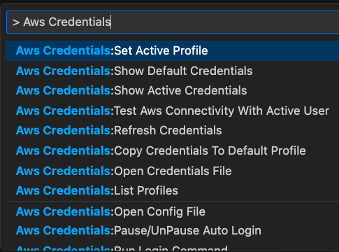

# Aws Access 

Manage your local AWS access credentials with ease! \
This powerful VSCode extension is designed to help you test, renew, and monitor your AWS access tokens. \
With a variety of features and a sleek, intuitive UI, you'll have all the tools you need to manage your credentials with ease.

Here are some features
- Monitor your AWS credentials status with a status bar item that updates in real-time
- Test your credentials to ensure they are valid and up-to-date
- Set your custom renewal bash script to automate the renewal process
- Open your local credentials and config files with a single click
- View a list of your profiles and access key and secret for each one
- Copy New Credentials to default profile
- Do not renew credentials if this Vscode has not renewed them

Say goodbye to manual credential management and focus on what matters most - your code! \
Try our extension now and experience the convenience of automatic credential renewal.

## Aws Credentials Setup
To Access Aws, you need to configure aws credentials.
For more detail on aws credentials \
https://docs.aws.amazon.com/cli/latest/userguide/cli-configure-files.html \
https://www.youtube.com/watch?v=SON8sY1iOBU

## Shared credentials and config ini files
Aws access credentials lives in the files below \
    - On Linux, Unix, and macOS: ~/.aws/credentials
    - On Windows: C:\Users\USER_NAME\.aws\credentials

## Profiles
You could have more then one credentials which is called Profiles.\
If you do not set a profile while calling an AWS resource through the AWS API, api will use default profile.

## To use this extension effectively
- Set the Active Profile you use, to do so Cmd+Shift+P then search Aws Access: Set Active Profile
- Set Aws Login Command, to do so Cmd+Shift+P then search Aws Access: Set Aws Login Command

## Commands

## Bug Report
To report your bugs or request new features, use link below\
https://github.com/necatiarslan/aws-access-vscode-extension/issues/new

For more detail on aws credentials
https://docs.aws.amazon.com/cli/latest/userguide/cli-configure-files.html

## TODO:
- Share Active Profile with other extensions
- Set up aws credentials
- fix when no credentials are found
- remove client-cloudwatch-logs

Thanks, \
Necati ARSLAN \
necatia@gmail.com